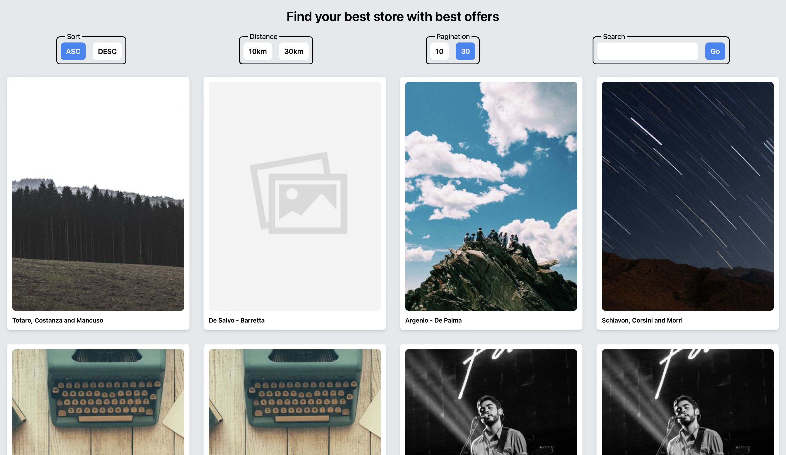
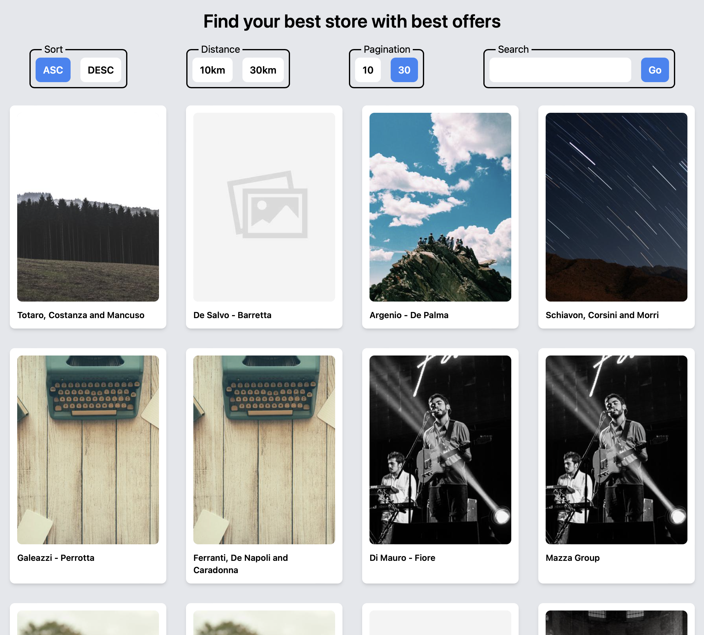
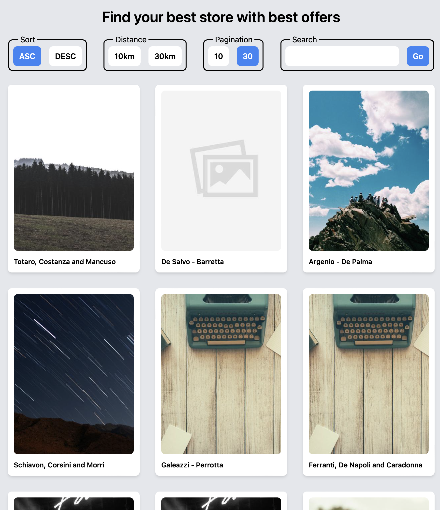
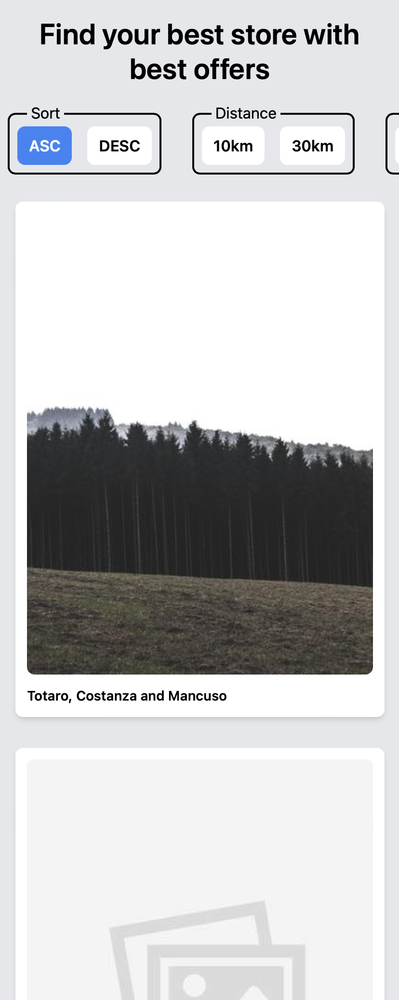

# Leaflets visualization

This project shown a basic leaflets visualization with responsive layout, with the technologies: React + Typescript and Tailwind CSS.

## Available Scripts

If you want to try this project, you have to download or clone this project. Once this is done, you have to run the following commands:

```bash
npm install
npm run start
```

## Some Screenshots





Mobile visualization

